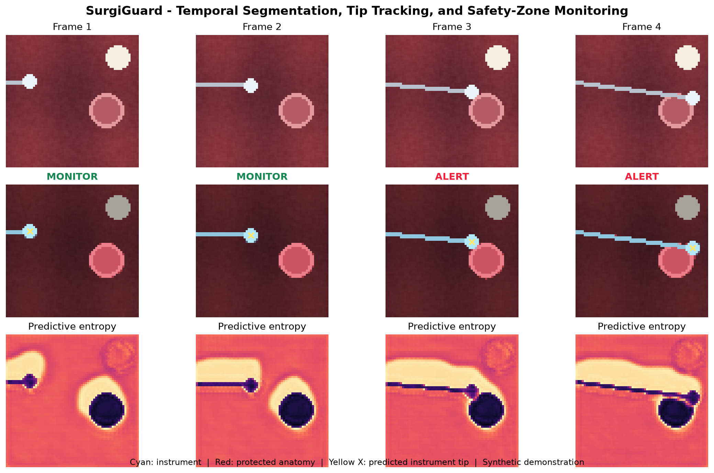
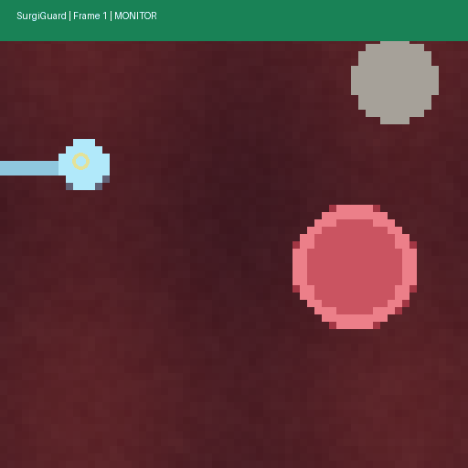
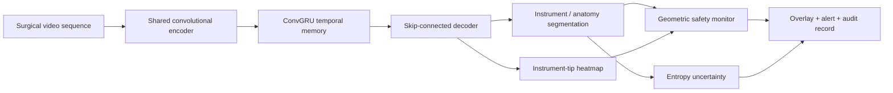

# SurgiGuard

## Uncertainty-Aware Surgical Video Intelligence

SurgiGuard is a portfolio research prototype for real-time surgical scene understanding. It trains a compact temporal network **from scratch** to segment instruments and protected anatomy, localize the instrument tip, and raise an interpretable proximity alert when the predicted tip approaches a protected region.

> **Evidence boundary:** the included benchmark uses procedurally generated surgical-like scenes. Results are synthetic-only and are not clinical claims. The architecture is ready for controlled evaluation on EndoVis, CholecSeg8k, or SAR-RARP50 after obtaining and reviewing the relevant dataset licenses.





## Why this project is different

- A custom temporal architecture rather than a wrapper around a pretrained segmentation model.
- Joint scene segmentation and instrument-tip localization.
- Explicit safety-zone reasoning instead of returning masks alone.
- Confidence calibration, temporal consistency, and difficult-condition evaluation.
- Reproducible training, tests, ONNX export, and numerical-equivalence validation.
- A C++ ONNX Runtime integration scaffold for high-performance deployment.

## Architecture



## Implemented pipeline

1. Deterministic procedural generation of short surgical-like video sequences.
2. Custom `TemporalSurgiNet` with a convolutional encoder, ConvGRU bottleneck, and dual segmentation/tip heads.
3. Multi-objective training: cross entropy, soft Dice, tip heatmap regression, and temporal consistency.
4. Evaluation: class IoU/Dice, tip error, risk-event precision/recall/F1, calibration error, and temporal jitter.
5. ONNX export and PyTorch/ONNX Runtime numerical-equivalence test.
6. Validation-only sweep that calibrates the geometric risk threshold and records the full precision/recall tradeoff.
7. Visual report containing input frames, predicted masks, uncertainty, tip estimates, and safety alerts.
8. Unit tests and GitHub Actions CI.

## Quick start

Python 3.10+ is recommended.

```bash
python -m venv .venv
source .venv/bin/activate
pip install -r requirements.txt

python -m unittest discover -s tests -v
python scripts/train.py --config configs/synthetic_mvp.json
python scripts/calibrate_risk.py
python scripts/export_onnx.py
python scripts/make_demo.py
```

Windows PowerShell:

```powershell
py -m venv .venv
.venv\Scripts\Activate.ps1
pip install -r requirements.txt
$env:PYTHONPATH="src"
python -m unittest discover -s tests -v
python scripts/train.py --config configs/synthetic_mvp.json
python scripts/calibrate_risk.py
python scripts/export_onnx.py
python scripts/make_demo.py
```

## Results

Generated metrics are saved to [`results/metrics.json`](results/metrics.json). Every generated artifact includes `evidence_type: synthetic_only` to prevent accidental presentation as clinical or public-dataset performance.

The next meaningful benchmark is a patient/video-separated evaluation on a public surgical dataset, with no neighboring frames shared between training and validation.

Final synthetic verification run: 0.950 mean foreground IoU, 0.944 instrument IoU, 0.955 protected-anatomy IoU, 0.067-pixel tip error, and 0.766 risk-event F1 on 24 held-out sequences. The risk threshold was selected by a validation-only sweep; the full tradeoff is recorded in [`results/risk_threshold_sweep.json`](results/risk_threshold_sweep.json). PyTorch and ONNX Runtime outputs matched within 1e-4.

## Repository map

```text
configs/                 Reproducible experiment configuration
src/surgiguard/          Model, dataset, loss, metrics, and risk logic
scripts/                 Train, evaluate, export, and demo entry points
tests/                   Unit and integration tests
cpp/                     ONNX Runtime C++ deployment scaffold
assets/                  Visual portfolio artifacts
artifacts/               Trained checkpoint and exported ONNX model
results/                 Metrics and training history
docs/                    Model card and real-data validation plan
```

## Interview-ready engineering discussion

- Why temporal memory reduces frame-to-frame mask flicker.
- Why safety monitoring must combine accuracy with calibration and uncertainty.
- How patient/video leakage can inflate validation performance.
- How ONNX numerical equivalence is verified before benchmarking latency.
- Which failures should stop the robot, warn the operator, or request human review.
- Why synthetic performance is useful for software verification but insufficient for clinical conclusions.

## Safety and intended use

This repository is a research and portfolio prototype. It is not a medical device, is not validated on patients, and must not be used for diagnosis, treatment, or robot control in a clinical environment.
