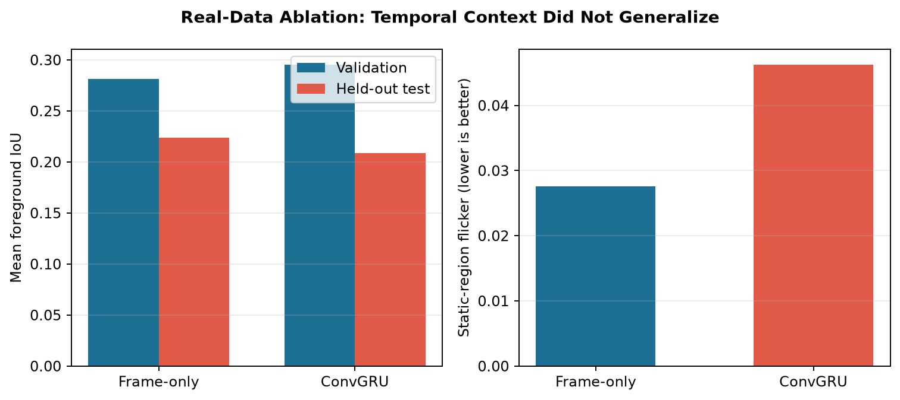
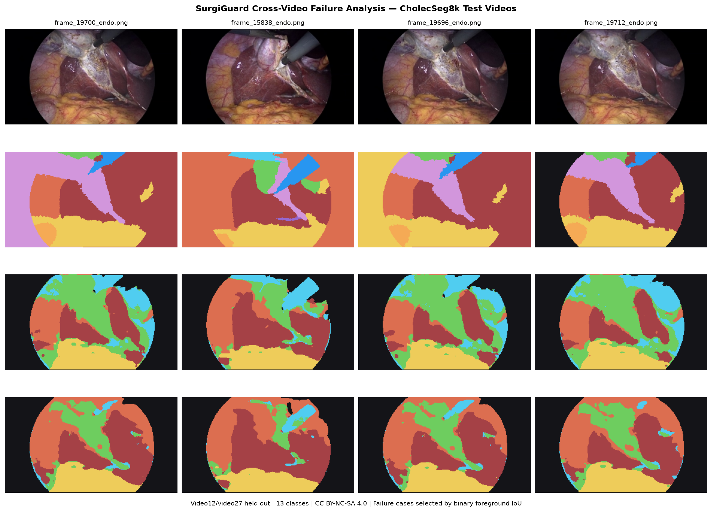
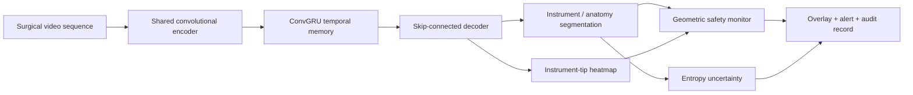

# SurgiGuard

## Uncertainty-Aware Surgical Video Intelligence

SurgiGuard is an end-to-end surgical-vision engineering project. It trains compact segmentation models **from scratch**, enforces source-video-separated evaluation, analyzes cross-video failures, exports models to ONNX, verifies numerical parity, and benchmarks compiled C++ inference.

> **Evidence boundary:** the real-data experiment uses a labeled subset of CholecSeg8k under CC BY-NC-SA 4.0. It is a portfolio benchmark, not a clinical-performance claim. The synthetic safety-monitor demo remains a separate software-verification experiment.

## Real-data experiment

Four-frame sequences are split by source video before sampling: 13 training videos, video17/video52 for validation, and untouched video12/video27 for test. The controlled subset contains 480 training, 120 validation, and 120 test sequences at 160x288 across 13 classes.

| Model | Best validation mIoU | Held-out test mIoU | Static-region flicker | Parameters |
|---|---:|---:|---:|---:|
| Frame-only | 0.282 | **0.224** | **0.0276** | 66,385 |
| ConvGRU + temporal loss | **0.296** | 0.209 | 0.0463 | 190,945 |



The temporal model wins on validation but loses on untouched test videos and flickers more on pixels whose ground-truth class is stable. The smaller frame-only model is therefore the deployment candidate. This negative result shows why selecting only from validation performance would be unsafe.



Full protocol and interpretation: [real-data report](docs/real_data_report.md). Machine-readable results: [ablation JSON](results/cholecseg8k_ablation.json).

## Deployment evidence

Both real-data models match PyTorch after ONNX export within 1e-4. A compiled C++17 ONNX Runtime executable performs warmups and reports median/p95 latency over repeated inference.

| Model | ONNX size | Max parity error | Python ORT CPU median / p95 | C++ ORT CPU median / p95 |
|---|---:|---:|---:|---:|
| Frame-only | 296 KB | 8.6e-6 | 69.6 / 170.4 ms | 98.7 / 182.1 ms |
| ConvGRU | 2.47 MB | 3.6e-6 | 67.7 / 115.0 ms | 191.2 / 332.1 ms |

The C++ measurements use one CPU inference thread, ten warmups, and 100 measured iterations. Image decoding and rendering are excluded.

## Synthetic safety-monitor prototype


## Why this project is different

- A custom temporal architecture rather than a wrapper around a pretrained segmentation model.
- Joint scene segmentation and instrument-tip localization.
- Explicit safety-zone reasoning instead of returning masks alone.
- Confidence calibration, temporal consistency, and difficult-condition evaluation.
- Reproducible training, tests, ONNX export, and numerical-equivalence validation.
- A compiled C++ ONNX Runtime benchmark with measured median and p95 latency.

## Architecture



## Implemented pipeline

1. CholecSeg8k sequence loading with official palette decoding and annotation-defect handling.
2. Source-video-separated train, validation, and untouched test splits.
3. Matched frame-only versus ConvGRU ablation with identical initialization.
4. Class IoU, ground-truth-aware static-region flicker, and visual failure analysis.
5. Synthetic segmentation, tip localization, uncertainty, and proximity-alert verification.
6. ONNX export, numerical-equivalence testing, CPU latency measurement, and compiled C++ benchmarking.
7. Seven unit tests and GitHub Actions CI.

## Quick start

Python 3.10+ is recommended.

The CholecSeg8k dataset is not redistributed. Obtain it from its official source or an authorized mirror and comply with CC BY-NC-SA 4.0.

```bash
python -m venv .venv
source .venv/bin/activate
pip install -r requirements.txt

python -m unittest discover -s tests -v
python scripts/train.py --config configs/synthetic_mvp.json
python scripts/calibrate_risk.py
python scripts/export_onnx.py
python scripts/make_demo.py
```

Real-data experiment:

```bash
python scripts/train_cholecseg8k.py --data-root /path/to/CholecSeg8k
python scripts/export_cholecseg8k_onnx.py
python scripts/make_real_report.py --data-root /path/to/CholecSeg8k
```

Windows PowerShell:

```powershell
py -m venv .venv
.venv\Scripts\Activate.ps1
pip install -r requirements.txt
$env:PYTHONPATH="src"
python -m unittest discover -s tests -v
python scripts/train.py --config configs/synthetic_mvp.json
python scripts/calibrate_risk.py
python scripts/export_onnx.py
python scripts/make_demo.py
```

## Results

Real metrics are saved to [results/cholecseg8k_ablation.json](results/cholecseg8k_ablation.json), ONNX parity/latency to [results/cholecseg8k_onnx.json](results/cholecseg8k_onnx.json), and compiled latency to [results/cpp_benchmark.json](results/cpp_benchmark.json).

Final synthetic verification run: 0.950 mean foreground IoU, 0.944 instrument IoU, 0.955 protected-anatomy IoU, 0.067-pixel tip error, and 0.766 risk-event F1 on 24 held-out sequences. The risk threshold was selected by a validation-only sweep; the full tradeoff is recorded in [`results/risk_threshold_sweep.json`](results/risk_threshold_sweep.json). PyTorch and ONNX Runtime outputs matched within 1e-4.

## Repository map

```text
configs/                 Reproducible experiment configuration
src/surgiguard/          Model, dataset, loss, metrics, and risk logic
scripts/                 Train, evaluate, export, and demo entry points
tests/                   Unit and integration tests
cpp/                     Compiled ONNX Runtime C++ benchmark
assets/                  Visual portfolio artifacts
artifacts/               Trained checkpoint and exported ONNX model
results/                 Metrics and training history
docs/                    Model card, real-data report, and interview notes
```

## Interview-ready engineering discussion

- Why temporal memory reduces frame-to-frame mask flicker.
- Why safety monitoring must combine accuracy with calibration and uncertainty.
- How patient/video leakage can inflate validation performance.
- How ONNX numerical equivalence is verified before benchmarking latency.
- Which failures should stop the robot, warn the operator, or request human review.
- Why synthetic performance is useful for software verification but insufficient for clinical conclusions.

## Safety and intended use

This repository is a research and portfolio prototype. It is not a medical device, is not validated on patients, and must not be used for diagnosis, treatment, or robot control in a clinical environment.
